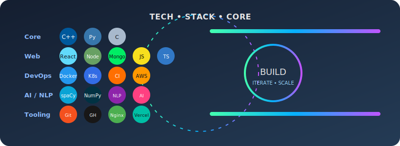
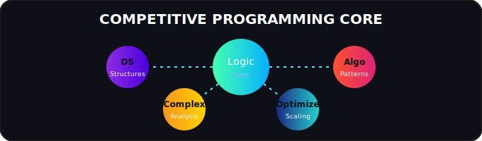

<!-- HERO: Typing + Tagline -->

  

  

  <b>Competitive Programming • DSA Architecture • MERN • DevOps Pipelines • NLP / AI • Systems Thinking</b>

<!-- QUICK HIGHLIGHTS -->

  
  
  
  
  

---

### 🚀 Snapshot
- 🎓 Final Year CSE @ **NIT Hamirpur**
- 🧠 Strongest in **C++ (CP & DSA)**; also Python & C
- 🌐 **MERN + DevOps:** backend APIs, deployment workflows, containerization
- 🤖 **AI / NLP:** spaCy, NumPy (expanding into transformers & semantic retrieval)
- 🏗️ Favorite project: **[ResuMatch AI](https://github.com/thakurshashant/resumatch-ai)** (resume–JD intelligent alignment)
- 🎯 Mission: Build reliable, performant, intelligence‑augmented developer tools
- 🧩 Enjoy optimizing complexity & designing clean abstractions

---

### 🛠️ Animated Tech Stack
<!-- This is a custom animated SVG (pulse, glow, subtle float).
     Replace / adjust icons by editing assets/stack-animated.svg -->

  

<!-- Fallback static icons row (stays if SVG fails to load) -->

  

---

### 📌 Featured Project

  

---

### 📊 GitHub Analytics

  
  

  

  

<!-- OPTIONAL: Uncomment after verifying reliability

  

-->

---

### 🧠 Competitive Programming Mindset

  

---

### 🤖 AI / NLP & Systems

  
  
  
  

---

### 🧩 Deep Dive (Expand)

  
<b>Architecture Preferences</b>

   
  <ul>
    <li>Modular service boundaries before premature microservices.</li>
    <li>Complexity budget: measurable cognitive + cyclomatic constraints.</li>
    <li>Favor composition over inheritance; explicit data contracts.</li>
    <li>Metrics-first: latency histograms, failure modes, capacity headroom.</li>
  </ul>

  
<b>Learning Roadmap 2025</b>

   
  <ul>
    <li>Transformer fine-tuning + lightweight adapters (LoRA, quantization).</li>
    <li>Advanced container orchestration patterns (multi-stage build optimizations).</li>
    <li>System design drills: low-latency matching engines & vector stores.</li>
  </ul>

---

### 🌐 Connect

  
  
  

---

### 🔢 Profile Views

  

<!-- OPTIONAL EXTRAS (Require GitHub Actions setup)
1. Contribution Snake:
   Add an action that generates output/github-contribution-grid-snake.svg and then:
   

2. Metrics (lowlighter/metrics):
   After configuring metrics.yml:
   
-->

<!-- LINK CHECK REMINDER:
Open each image URL in a browser to verify; dynamic services may rate-limit intermittently. -->

<!-- END -->
